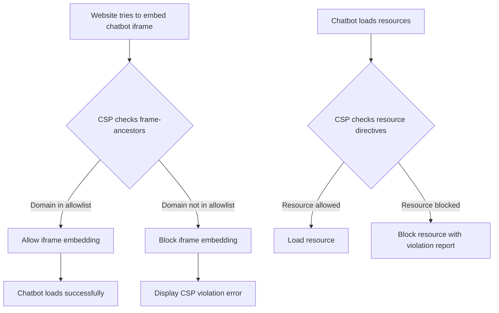

# Chatbot Widget with Content Security Policy (CSP)

A secure React + Vite + TypeScript chatbot widget designed to be embedded as an iframe in other websites, protected by a strict Content Security Policy to prevent unauthorized embedding and clickjacking attacks.

## 🔒 Security Features

This project implements a comprehensive Content Security Policy (CSP) that:

- **Prevents unauthorized embedding** - Only specified trusted domains can embed the chatbot iframe
- **Blocks clickjacking attacks** - Uses the `frame-ancestors` directive to control embedding
- **Enforces secure resource loading** - Restricts scripts, styles, and connections to trusted sources
- **Supports development workflow** - Includes localhost and ngrok support for testing

## 📋 Table of Contents

- [CSP Implementation Details](#csp-implementation-details)
- [Security Configuration](#security-configuration)
- [Allowed Domains Management](#allowed-domains-management)
- [Development Workflow](#development-workflow)
- [Deployment Guide](#deployment-guide)
- [Testing](#testing)
- [Troubleshooting](#troubleshooting)
- [Technical Specifications](#technical-specifications)

## 🛡️ CSP Implementation Details

### What is Content Security Policy (CSP)?

Content Security Policy is a security standard that helps prevent cross-site scripting (XSS), clickjacking, and other code injection attacks by controlling which resources can be loaded and from where.

### CSP Workflow in This Project



### CSP Directives Implemented

The following CSP directives have been configured in `index.html`:

```html
<meta http-equiv="Content-Security-Policy" content="
  default-src 'self';
  script-src 'self';
  style-src 'self' 'unsafe-inline';
  img-src 'self' data:;
  connect-src 'self' https://*.ngrok.io;
  frame-ancestors https://www.my-website.com https://testsite.com http://localhost:5173;
" />
```

#### Directive Breakdown:

1. **`default-src 'self'`**
   - **Purpose**: Sets the default policy for all resource types
   - **Effect**: Only allows resources from the same origin (where the chatbot is hosted)
   - **Security**: Prevents loading malicious resources from external domains

2. **`script-src 'self'`**
   - **Purpose**: Controls JavaScript execution
   - **Effect**: Only allows scripts from the same origin
   - **Security**: Prevents XSS attacks via malicious scripts

3. **`style-src 'self' 'unsafe-inline'`**
   - **Purpose**: Controls CSS stylesheet loading and inline styles
   - **Effect**: Allows styles from same origin and inline styles
   - **Note**: `'unsafe-inline'` is required for React's inline styles but represents a security trade-off

4. **`img-src 'self' data:`**
   - **Purpose**: Controls image loading
   - **Effect**: Allows images from same origin and data URIs
   - **Use case**: Supports base64 encoded images and local assets

5. **`connect-src 'self' https://*.ngrok.io`**
   - **Purpose**: Controls network connections (fetch, XHR, WebSocket)
   - **Effect**: Allows connections to same origin and ngrok tunnels
   - **Development**: Supports ngrok for testing and development

6. **`frame-ancestors https://www.my-website.com https://testsite.com http://localhost:5173`**
   - **Purpose**: Controls which domains can embed this page in frames/iframes
   - **Effect**: Only specified domains can embed the chatbot
   - **Security**: Prevents clickjacking attacks and unauthorized embedding

## 🔧 Security Configuration

### Current Allowed Domains

The following domains are currently allowed to embed the chatbot iframe:

- `https://www.my-website.com` - Production website
- `https://testsite.com` - Test website
- `http://localhost:5173` - Local development server

### Security Benefits

1. **Clickjacking Protection**: Prevents malicious websites from embedding your chatbot invisibly
2. **XSS Mitigation**: Restricts script execution to trusted sources only
3. **Resource Control**: Ensures only legitimate resources are loaded
4. **Embedding Control**: Gives you complete control over where your chatbot can be used

## 📝 Allowed Domains Management

### Adding New Domains

To allow additional domains to embed your chatbot:

1. **Edit `index.html`**
   ```html
   <!-- Find this line in the CSP meta tag -->
   frame-ancestors https://www.my-website.com https://testsite.com http://localhost:5173;
   
   <!-- Add your new domain -->
   frame-ancestors https://www.my-website.com https://testsite.com http://localhost:5173 https://new-domain.com;
   ```

2. **Domain Format Requirements**
   - Use full URLs with protocol: `https://` or `http://`
   - For localhost development: `http://localhost:PORT`
   - For production domains: `https://domain.com`
   - Separate multiple domains with spaces

3. **Rebuild and Deploy**
   ```bash
   npm run build
   # Deploy to your static host
   ```

### Removing Domains

To remove a domain from the allowlist:

1. **Edit `index.html`**
2. **Remove the domain** from the `frame-ancestors` directive
3. **Rebuild and deploy**

### Domain Examples

```html
<!-- Production domains -->
frame-ancestors https://www.my-website.com https://app.example.com;

<!-- Development domains -->
frame-ancestors http://localhost:3000 http://localhost:5173 http://127.0.0.1:8080;

<!-- Mixed environment -->
frame-ancestors https://www.my-website.com https://staging.my-website.com http://localhost:5173;
```

## 🚀 Development Workflow

### Local Development

1. **Start the development server**
   ```bash
   npm install
   npm run dev
   ```

2. **Test CSP functionality**
   - Open `csp-test.html` in your browser
   - Verify the iframe loads correctly
   - Check browser console for any CSP violations

3. **Test from different domains**
   - Try embedding from an allowed domain (should work)
   - Try embedding from a non-allowed domain (should be blocked)

### CSP Testing Workflow

```bash
# 1. Start development server
npm run dev

# 2. Open test file
open csp-test.html

# 3. Check browser console for CSP violations
# 4. Test from different domains
# 5. Verify allowed domains work
# 6. Verify blocked domains are prevented
```

## 🌐 Deployment Guide

### Static Hosting Platforms

This CSP configuration works with all major static hosting platforms:

#### Netlify
1. Build your project: `npm run build`
2. Deploy the `dist` folder to Netlify
3. CSP will be automatically enforced

#### Vercel
1. Build your project: `npm run build`
2. Deploy to Vercel
3. CSP meta tag will be served with each request

#### GitHub Pages
1. Build your project: `npm run build`
2. Deploy the `dist` contents to GitHub Pages
3. CSP protection is active immediately

### Production Deployment Checklist

- [ ] Update `frame-ancestors` with production domains
- [ ] Remove localhost from `frame-ancestors` (optional)
- [ ] Test CSP functionality in production
- [ ] Monitor browser console for CSP violations
- [ ] Verify all allowed domains can embed the chatbot

## 🧪 Testing

### CSP Test File

A test file `csp-test.html` has been created to help you verify CSP functionality:

```bash
# Run the test
npm run dev
# Open csp-test.html in your browser
```

### Testing Scenarios

1. **Allowed Domain Test**
   - Embed the chatbot from an allowed domain
   - Should load successfully without CSP violations

2. **Blocked Domain Test**
   - Try to embed from a non-allowed domain
   - Should be blocked with CSP violation error

3. **Browser Console Monitoring**
   - Check for CSP violation reports
   - Monitor any blocked resources

### CSP Violation Reporting

The browser will report CSP violations in the console. Common violations include:

```
Refused to frame 'https://your-chatbot.com' because an ancestor violates the following Content Security Policy directive: "frame-ancestors https://www.my-website.com"
```

## 🔍 Troubleshooting

### Common Issues

#### 1. Chatbot Not Loading in Iframe

**Problem**: Iframe shows blank or error message
**Solution**: Check if the parent domain is in the `frame-ancestors` allowlist

#### 2. CSP Violations in Console

**Problem**: Console shows CSP violation errors
**Solution**: 
- Verify the violating domain is in `frame-ancestors`
- Check for typos in domain names
- Ensure correct protocol (http vs https)

#### 3. Styles Not Loading

**Problem**: Chatbot appears unstyled
**Solution**: Verify `style-src` directive includes `'unsafe-inline'`

#### 4. Scripts Not Executing

**Problem**: JavaScript functionality not working
**Solution**: Check `script-src` directive allows same-origin scripts

### Debugging Steps

1. **Check Browser Console**
   ```javascript
   // Look for CSP violation messages
   console.log("CSP violations will appear here");
   ```

2. **Verify CSP Meta Tag**
   ```html
   <!-- Ensure this tag is present in index.html -->
   <meta http-equiv="Content-Security-Policy" content="...">
   ```

3. **Test with CSP Disabled** (temporarily)
   ```html
   <!-- Comment out CSP meta tag to test without restrictions -->
   <!-- <meta http-equiv="Content-Security-Policy" content="..."> -->
   ```

### CSP Violation Examples

```javascript
// Example violation message:
// Refused to load the script 'https://malicious-site.com/script.js' 
// because it violates the following Content Security Policy directive: 
// "script-src 'self'".

// Example frame-ancestors violation:
// Refused to frame 'https://your-chatbot.com' because an ancestor 
// violates the following Content Security Policy directive: 
// "frame-ancestors https://www.my-website.com".
```

## 📊 Technical Specifications

### Browser Support

CSP is supported in all modern browsers:
- Chrome 25+
- Firefox 23+
- Safari 7+
- Edge 12+

### CSP Level

This implementation uses CSP Level 2 directives, providing comprehensive protection while maintaining compatibility.

### Performance Impact

- **Minimal overhead**: CSP checking adds negligible performance impact
- **Client-side enforcement**: No server-side processing required
- **Fast blocking**: Violations are blocked immediately without network requests

### Security Standards Compliance

This CSP implementation follows:
- OWASP Content Security Policy guidelines
- W3C CSP specification
- Security best practices for iframe embedding

## 📚 Additional Resources

- [MDN Content Security Policy](https://developer.mozilla.org/en-US/docs/Web/HTTP/CSP)
- [OWASP CSP Cheat Sheet](https://cheatsheetseries.owasp.org/cheatsheets/Content_Security_Policy_Cheat_Sheet.html)
- [CSP Evaluator Tool](https://csp-evaluator.withgoogle.com/)
- [Frame-Ancestors Directive](https://developer.mozilla.org/en-US/docs/Web/HTTP/Headers/Content-Security-Policy/frame-ancestors)

## 🤝 Contributing

When making changes to the CSP configuration:

1. Test thoroughly with the provided test file
2. Verify all allowed domains still work
3. Check for new CSP violations
4. Update this README if adding new directives or domains

## 📄 License

This project is licensed under the MIT License - see the LICENSE file for details.

---

**Security Note**: Always test CSP changes in a development environment before deploying to production. CSP violations can break functionality if not properly configured.